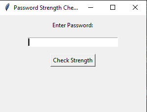
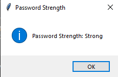

# Password Strength Checker

## Description
This is a simple **Password Strength Checker** built using Python and Tkinter. It evaluates password security based on specific criteria such as length, uppercase/lowercase letters, numbers, and special characters. The application provides feedback on password strength through a graphical user interface (GUI).

## Features
- **Graphical Interface**: Uses Tkinter for a simple UI.
- **Real-time Evaluation**: Checks password strength instantly.
- **Criteria-Based Strength Assessment**:
  - At least 8 characters
  - Includes uppercase and lowercase letters
  - Contains numbers
  - Has special characters
- **Alerts and Warnings**: Displays messages for feedback.

## Installation
Ensure you have Python installed. You can install Tkinter (if not pre-installed) using:
```sh
pip install tk
```

## Usage
1. Run the script:
```sh
python password_strength_checker.py
```
2. Enter a password in the input field.
3. Click "Check Strength" to evaluate.

## Images



## Contribution
Feel free to contribute by submitting issues or pull requests.
